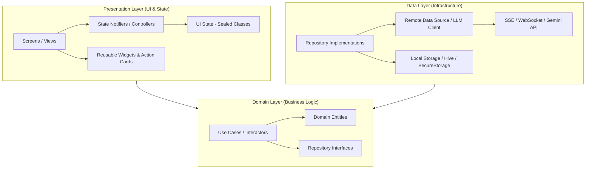
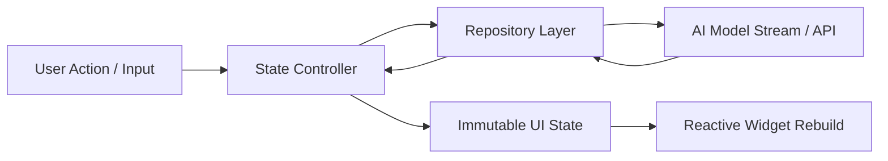
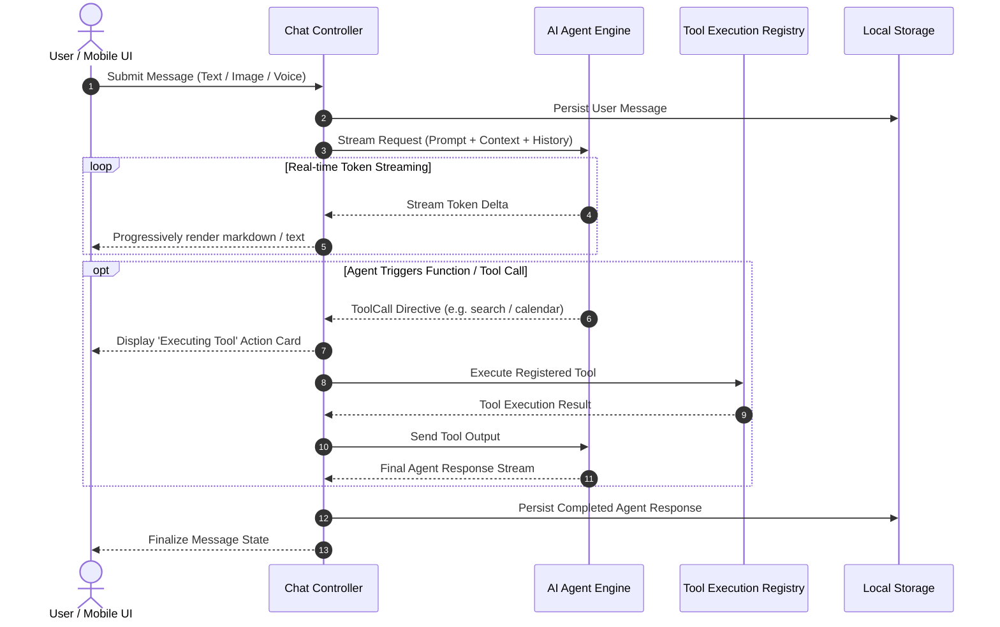
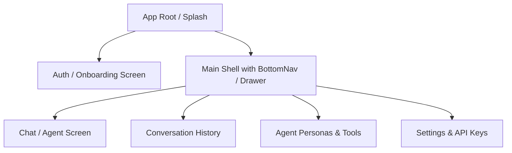
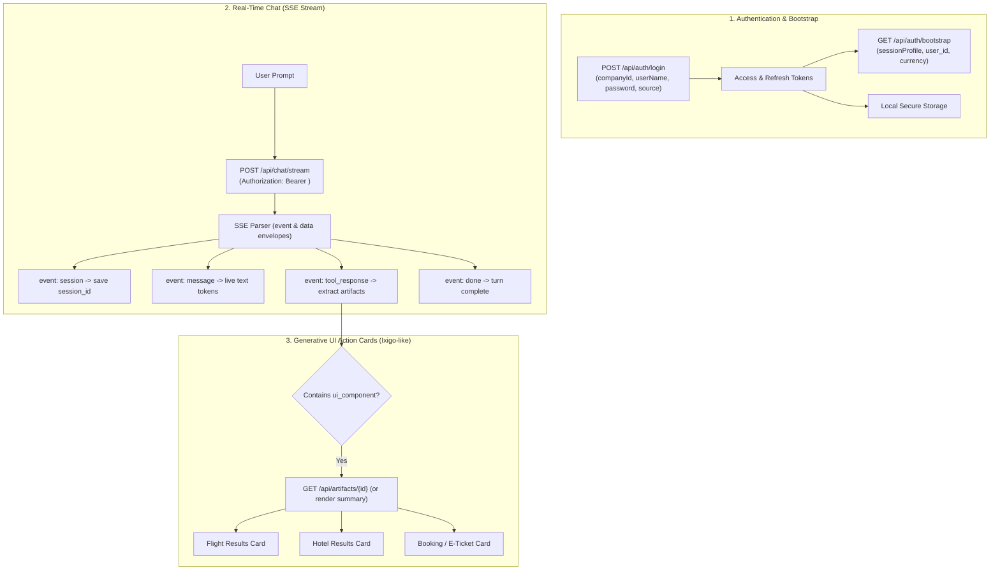

# 🧠 PLANNING.md - AIVA AI Agent Mobile

> **Master System Architecture, Product Specification & Engineering Roadmap**  
> *Last Updated: 2026-09-21*

---

## 🧭 1. Product Manager Perspective

### 1.1 Product Vision & Strategy
**AIVA (Artificial Intelligence Virtual Assistant)** is an autonomous, multimodal AI Agent mobile application crafted with Flutter. It delivers an intuitive, instant, and privacy-focused companion interface designed for seamless cross-platform execution on Android and iOS.

### 1.2 User Personas & Target Segments
| Persona | Key Needs | Primary Features |
| :--- | :--- | :--- |
| **Power Users & Developers** | Real-time code execution, syntax highlighting, custom tool calling, low-latency responses. | Code blocks with 1-tap copy, tool execution cards, customizable system prompts. |
| **Busy Professionals** | Fast voice input, document/image summarization, calendar/task action triggers. | Multimodal attachments, Voice Speech-to-Text, task orchestration. |
| **Everyday Consumers** | Fluid conversational UI, dark/light themes, offline conversation history. | Chat history drawer, search, conversational memory, customizable avatars. |

### 1.3 Key Performance Indicators (KPIs)
- **Time to First Token (TTFT)**: < 600ms on broadband / 4G connections.
- **App Startup (Cold Start)**: < 1.2s to interactive chat state.
- **Frame Render Rate**: Constant 60fps/120fps during streaming text generation and scrolling.
- **Crash-Free Sessions**: > 99.9%.

---

## 🏛️ 2. Software Architect Perspective

### 2.1 System Architecture Overview
AIVA is built using **Feature-First Clean Architecture**. This decouples business logic, domain entities, and data sources from UI rendering, ensuring strict modularity, testability, and adherence to the `< 500 lines per file` constraint.



### 2.2 Unidirectional Data Flow
State flows strictly unidirectionally from the state controllers to the UI via immutable data models.



### 2.3 AI Agent Streaming & Tool Calling Pipeline
When an agent is prompted, it can stream tokens in real-time or trigger client/server tool calls.



### 2.4 Application Feature & Route Tree


---

### 2.5 AgenticBox Real-Time Travel API Architecture
The application integrates with the **AgenticBox backend (`http://ai-uat.quadlabs.net/api`)** using Server-Sent Events (SSE) streaming and Bearer token authentication.



---

## 💻 3. Software Developer Perspective

### 3.1 Backend Endpoints & Wire Protocol
- **Base URL**: `http://ai-uat.quadlabs.net/api`
- **Auth Login**: `POST /api/auth/login`
- **Auth Bootstrap**: `GET /api/auth/bootstrap?travogBaseUrl=...`
- **Auth Refresh**: `POST /api/auth/refresh`
- **Chat Stream**: `POST /api/chat/stream` (`text/event-stream`)
- **Artifacts**: `GET /api/artifacts/{artifact_id}`
- **Sessions**: `GET /api/chat/sessions`, `GET /api/chat/sessions/{id}`

### 3.2 Target Directory Map
```text
lib/
├── main.dart                       # Entry point & dependency initialization
├── app.dart                        # MaterialApp, theme configuration & routing
└── src/
    ├── core/
    │   ├── constants/              # api_endpoints.dart, app_colors.dart
    │   ├── error/                  # Failure definitions & exception classes
    │   ├── network/                # api_client.dart, sse_client.dart
    │   ├── routing/                # App router (Auth guard / main navigation)
    │   ├── theme/                  # app_theme.dart (M3 light & dark)
    │   ├── utils/                  # Currency (₹), date, duration formatters
    │   └── services/               # Token storage & session persistence
    ├── features/
    │   ├── auth/                   # Direct login & session bootstrap
    │   │   ├── data/               # auth_remote_data_source, auth_local_data_source
    │   │   ├── domain/             # auth_token, user_profile, login_usecase
    │   │   └── presentation/       # auth_bloc, login_screen
    │   ├── chat/                   # Conversational AI & SSE streaming
    │   │   ├── data/               # chat_remote_data_source (SSE), models
    │   │   ├── domain/             # chat_message, sse_event, chat_repository
    │   │   └── presentation/       # chat_bloc, chat_screen, widgets
    │   └── travel/                 # Ixigo-like Flight, Hotel, Train action cards
    │       ├── data/               # artifact_remote_data_source
    │       ├── domain/             # flight, hotel, booking entities
    │       └── presentation/       # flight_result_card, hotel_result_card, artifact_renderer
    └── shared/
        ├── widgets/                # app_button, app_text_field, app_loading_indicator
        └── models/                 # universal domain models
```

### 3.3 Core Dependencies Blueprint
- **State Management**: `flutter_bloc: ^9.1.1`
- **Networking & SSE**: `http: ^1.2.0` / `dio` with streaming
- **Persistence**: `shared_preferences: ^2.3.0` / `flutter_secure_storage`
- **Formatting & Utilities**: `intl: ^0.19.0`
- **Icons & UI**: `cupertino_icons: ^1.0.8`, Material 3 icons

---

## 📋 4. Engineering Guardrails & Principles

1. **File Size Ceiling**: No single file may exceed **500 lines of code**.
2. **Zero Linter Warnings**: Code must always pass `flutter analyze` cleanly.
3. **Living Bug Prevention**: If an agent bug is discovered, it must be logged in `rules/things-to-avoid.mdc`.
4. **Vibe Coding Discipline**: Follow the 4-phase cycle: **Plan -> Implement -> Test -> Document**.


